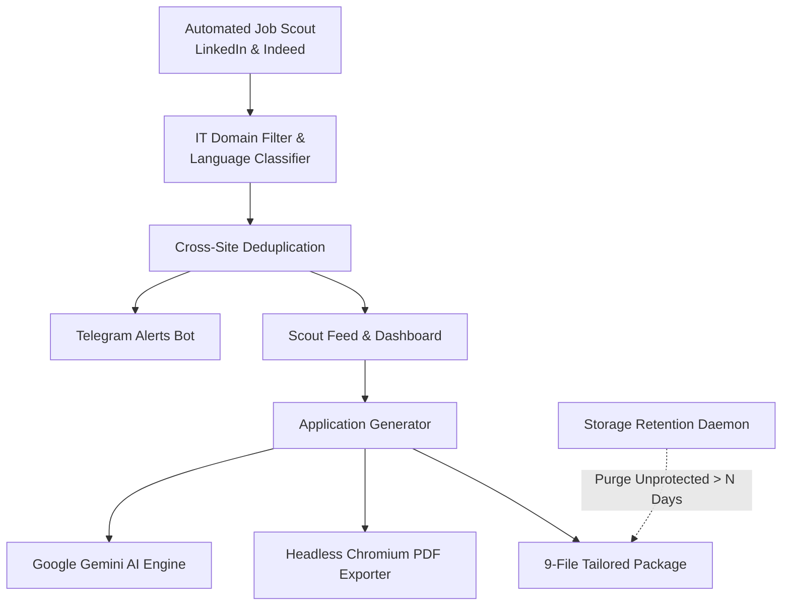

# 🎯 Job Hunt Command Center

> Autonomous Career Pipeline, Multi-Source Job Discovery, AI Application Tailoring & Storage Management.

Job Hunt Command Center is a self-hosted, privacy-first career intelligence platform designed for IT, Systems, and Cybersecurity professionals. It scrapes live job boards across Finland and EU Remote, evaluates postings against your master candidate profile, generates tailored application packages using Google Gemini AI, sends instant Telegram notifications for high-match opportunities, and provides an interactive Kanban & analytics dashboard.

---

## ✨ Key Features

### 🔍 Autonomous Multi-Source Job Scout
- **Targeted Sourcing:** Scrapes **LinkedIn** and **Indeed** using `python-jobspy`.
- **Domain & Language Intelligence:** Built-in IT domain filter eliminates non-technical noise. Automatically classifies Finnish language requirements (`[FI-REQ]`, `[FI-BONUS]`, `[EN-FRIENDLY]`).
- **Cross-Site Deduplication:** Eliminates identical positions reposted across multiple boards or staffing agencies.
- **Match Calibration:** Scores job descriptions directly against your master profile keywords.

### 🤖 Multi-Skill AI Application Tailoring
Generates a complete **9-file tailored package** for every target role in seconds:
1. **Job Description Markdown:** Cleaned snapshot of job posting details and requirements.
2. **Strategic Job Analysis:** Requirement-to-evidence mapping, leveling calibration, and culture strategy.
3. **Tailored CV:** Calibrated summary and targeted Google X-Y-Z bullet points.
4. **Vector-Text A4 PDF CV:** ATS-compliant, recruiter-ready PDF generated via headless Chromium.
5. **Strategic 3-Pillar Cover Letter:** Hook, evidence-backed value proposition, and cultural alignment (< 1500 chars).
6. **Vector-Text A4 PDF Cover Letter:** Polished print-ready PDF matching CV typography.
7. **Screening Portal Q&A:** Direct, non-crammed Greenhouse / Workday / Lever form answers.
8. **Interview Prep & STAR Talking Points:** Elevator pitch, technical deep-dive stories, reverse questions for hiring managers, and Finnish market salary guidance.
9. **Cold Outreach & Networking Drafts:** LinkedIn connection note (< 300 chars), Recruiter InMail, and 7-day follow-up messages.

### 📱 Real-Time Telegram Alerts
- Delivers instant notifications for new opportunities matching your minimum score threshold.
- Persistent state tracking ensures identical jobs are never notified twice.
- 1-click links to direct job postings and match breakdowns.

### 🧹 Automated Storage Retention & Cleanup
- Automated lifecycle management purges expired or inactive job folders older than $N$ days.
- **Status Protection:** Jobs marked as `Applied`, `Interviewing`, or `Offer` are permanently protected from deletion.
- **Dual Cleanup Modes:** `full` (removes entire role folder) or `pdfs_only` (reclaims heavy PDF disk space while preserving markdown records).
- Optional Telegram notification summarizing reclaimed disk space.

### 📊 Modern Web Command Center
- Responsive dark-mode dashboard built with Tailwind CSS and Lucide icons.
- Real-time pipeline tracking (Scouted $\rightarrow$ Ready to Apply $\rightarrow$ Applied $\rightarrow$ Interviewing $\rightarrow$ Offer $\rightarrow$ Rejected).
- In-browser file previewer with Markdown rendering and PDF downloads.
- Direct 1-click action triggers: Run Scout, Generate Packages, and Manage Retention.

---

## 🛠️ System Architecture



---

## 🚀 Quick Start (Local Setup)

### 1. Prerequisites
- Python 3.12+
- [`uv`](https://github.com/astral-sh/uv) (fast Python package manager)
- Google Chrome or Chromium (for vector PDF compilation)

### 2. Clone and Configure
```bash
git clone https://github.com/kakalpa/jobhunt.git
cd jobhunt

# Create environment configuration
cp .env.example .env

# Create your master candidate profile
cp Base_CV.template.md Base_CV.md
cp pipeline_data.template.json pipeline_data.json
```

Edit `.env` with your API keys and preferences:
```ini
GEMINI_API_KEY="your-gemini-api-key"
TELEGRAM_BOT_TOKEN="your-bot-token"
TELEGRAM_CHAT_ID="your-chat-id"
TELEGRAM_MIN_MATCH_SCORE=80
```

Edit `Base_CV.md` with your verified skills, experience, and contact details.

### 3. Launch Dashboard
```bash
chmod +x start_dashboard.sh
./start_dashboard.sh
```
Open [http://localhost:5500](http://localhost:5500) in your browser.

---

## 🐳 Docker Deployment

Run the complete stack autonomously with Docker Compose:

```bash
docker-compose up -d --build
```

The container automatically:
1. Launches the Flask GUI Command Center at port `5500`.
2. Starts the background autonomous scout daemon (runs every 2 hours by default).
3. Evaluates storage retention thresholds and executes disk cleanups.
4. Preserves all generated packages and database records on a persistent host mount `./workspace`.

---

## ☁️ Zero-Cost Cloud Hosting Guide

You can host Job Hunt Command Center **100% free** 24/7 using:

### Option A: Oracle Cloud Always Free VM (Recommended)
- Oracle Cloud offers 4 ARM Ampere cores + 24GB RAM free forever.
- Deploy the Docker image directly onto an Ubuntu VM.
- Access your dashboard via WireGuard / Tailscale VPN for zero public exposure.

### Option B: Local Micro-Server / Old Laptop / Home NAS
- Run `docker-compose up -d` on any existing home server or Raspberry Pi (8GB).
- Use [Tailscale](https://tailscale.com/) or [Cloudflare Tunnels](https://developers.cloudflare.com/cloudflare-one/connections/connect-networks/) for secure remote access from anywhere without port forwarding.

---

## 🔒 Privacy & Security

- **Zero Data Leakage:** Your master profile (`Base_CV.md`), job trackers, contact information, and generated PDFs remain strictly on your local machine or private container.
- **No Third-Party Analytics:** The application contains zero trackers or telemetry.
- **Direct API Calls:** Generative AI calls communicate directly with Google Gemini using standard HTTPS requests.

---

## 🔐 Public Server Hardening & Multi-Factor Authentication (MFA)

When hosting on a public IP or internet-facing domain, enable the built-in security subsystem in `.env`:

```ini
AUTH_ENABLED=true
ADMIN_USERNAME="admin"
ADMIN_PASSWORD="YourStrongPasswordHere"
MFA_ENABLED=true
SECRET_KEY="your-random-32-byte-hex-secret"
```

### Security Guarantees:
1. **Scrypt/PBKDF2 Password Hashing:** Salted, collision-resistant cryptographic verification via `werkzeug.security`.
2. **RFC 6238 TOTP Multi-Factor Authentication:** Native TOTP compatible with **Google Authenticator**, **Microsoft Authenticator**, **Aegis**, and **1Password**.
3. **First-Time QR Setup:** Client-side SVG QR code generator keeps secrets off third-party APIs.
4. **Emergency Recovery Codes:** Generates 8 one-time emergency backup codes for account restoration.
5. **Brute-Force Rate Limiting:** 5-attempt threshold with automatic 15-minute IP lockouts to prevent credential stuffing.
6. **CSRF Protection & Security Headers:** Enforces `X-CSRF-Token` on all mutations; delivers `X-Frame-Options: DENY`, `X-Content-Type-Options: nosniff`, and `Content-Security-Policy`.
7. **Production WSGI Readiness:** Automatically launches with **Gunicorn** in Docker for multi-worker concurrency.
8. **CLI Management Tool:** Configure users or reset MFA anytime via:
   ```bash
   python3 scripts/auth_manager.py
   python3 scripts/auth_manager.py reset-mfa
   ```

---

## 📄 License
MIT License. Feel free to customize and automate your career hunt!
