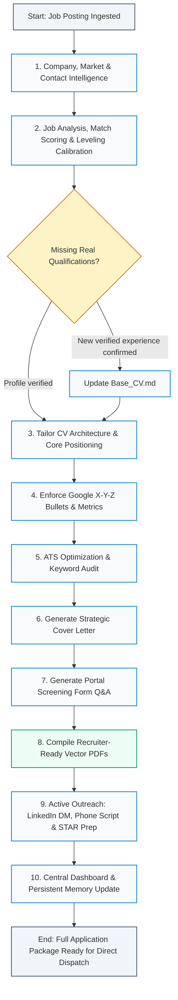

# Job Application Workflow Diagram (v3 High-Conversion Edition)

## End-to-End High-Conversion Pipeline for Competitive European & Finnish Tech Markets

---

## Step-by-Step Workflow Description

### 1. Company, Market & Contact Intelligence
- **Skills**: `finnish-job-market-tailor`, web search
- **Actions**:
  - Identify the exact hiring model: Direct employer, Finnish public sector (Kuntarekry/Valtiolle), global MSP, or recruiting agency.
  - Locate the named **Contact Person / Hiring Manager / Recruiter** and note explicit calling hours.
  - Identify collective agreement context (IT-alan TES, AVAINTA, KT), work arrangement (remote vs hybrid), and language requirements.
- **Output**: Strategic context for tone, compensation calibration, and outreach strategy.

### 2. Job Analysis, Match Scoring & Leveling Calibration
- **Skill**: `job-description-analyzer`
- **Output**: `Job_Analysis_<Role>.md`
  - Match score (% fit) and keyword taxonomy (must-have vs preferred).
  - **Leveling Calibration (Anti-Overqualification Check):** 
    - *Junior/L1/Support Roles:* Frame candidate narrative around **Hands-on Operational Excellence, High First-Time-Fix Rates, and Zero Ramp-Up Time**, avoiding intimidating "Senior Architect" overtones that trigger flight-risk rejections.
    - *Mid-Level Roles:* Frame narrative around **Technical Autonomy, Problem Isolation, and Infrastructure Reliability**.
    - *Senior/Lead Roles:* Frame narrative around **Governance, Architecture, CAB Leadership, and Mentorship**.

### 3. Base Profile Validation & Tailoring
- **Skill**: `resume-tailor`
- **Input**: Base CV (`Base_CV.md`) + Job Analysis
- **Actions**:
  - Reorder experience and technical skills to match the target job's primary stack.
  - **Market Anti-Friction Badges:** Ensure header clearly defines residency/work authorization (*"Location: Turku / Helsinki, Finland (Full EU Work Authorization / Resident)"*) and transparent language proficiency (*"English (Fluent/C1), Finnish (Conversational / Actively studying)"*).
  - Clean footer: Always conclude with verified professional references (Mr. Tero Virtanen, Senior Lecturer, TUAS); omit generic disclaimer footers.

### 4. Mandatory Google X-Y-Z Bullet Engineering
- **Skills**: `resume-bullet-writer`, `resume-quantifier`
- **Formula**: Every single bullet point MUST follow Laszlo Bock's Google formula:
  > **Accomplished [X] as measured by [Y], by doing [Z]**
- **Strict Linting Rules**:
  - **[X] (Outcome / Impact):** Opens with an active power verb stating the business, technical, or security outcome. Zero passive duties (*"Responsible for", "Helped with", "Worked on"*).
  - **[Y] (Metric / Scale):** Must contain a tangible metric (%, time reduction, €, users, endpoints, SLA adherence, incident count).
  - **[Z] (Method / Technology):** Explains the exact tools, architectures, protocols, or automations applied.

### 5. ATS Optimization & Keyword Audit
- **Skill**: `resume-ats-optimizer`
- **Output**: `ATS_Optimization_Report_<Role>.md`
  - Targets 90%+ ATS compatibility score.
  - Verifies exact phrase matches, section headers, clean text parseability, and absence of table/column traps.

### 6. Strategic Cover Letter Generation
- **Skill**: `cover-letter-generator`
- **Output**: `<Candidate>_Cover_Letter_<Role>.md`
  - Addressed to the named hiring manager or team lead.
  - 3 clear value pillars connecting the candidate's achievements directly to the employer's pain points.
  - Proactively defuses potential concerns (e.g. leveling fit, language, or commute).

### 7. Portal Screening Form Q&A
- **Skill**: `application-form-filler`
- **Output**: `Application_Form_Answers_<Role>.md`
  - Ready-to-paste answers for open text fields in application portals (Workday, Ashby, Lever, Teamtailor).
  - Bilingual versions (English and Finnish) where appropriate for Finnish employer portals.

### 8. Recruiter-Ready PDF Compilation
- **Skill**: `pdf-cv-exporter`
- **Tool**: `scripts/export_pdf.py` (`uv run --with markdown python3` + headless Chromium)
- **Output**:
  - `<Candidate>_<Role>.pdf`
  - `<Candidate>_Cover_Letter_<Role>.pdf`
- Vector text, clean A4 margins, zero browser clutter.

### 9. Active Direct Outreach Protocol & Interview Prep
- **Skills**: `interview-prep-generator`, `cold-email-writer`
- **Output**: `Interview_Prep_<Role>.md` (Upgraded with Active Outreach Plan):
  - **Direct Outreach (The Differentiator):**
    - **Phone Script:** 2-minute phone script for calling the named recruiter/contact person during stated calling hours.
    - **LinkedIn DM / InMail:** 100-word personalized message to the Hiring Manager / Lead.
    - **5-Day Follow-Up Message:** Professional status check to break out of the ATS black hole.
  - **Technical Interview Drill:** Top 5 STAR-method scenarios and 3 strategic questions to ask the interview panel.

### 10. Central Dashboard & Memory Tracking
- **Output**:
  - Update application pipeline database (`pipeline_data.json`).
  - Track application state in Command Center dashboard.